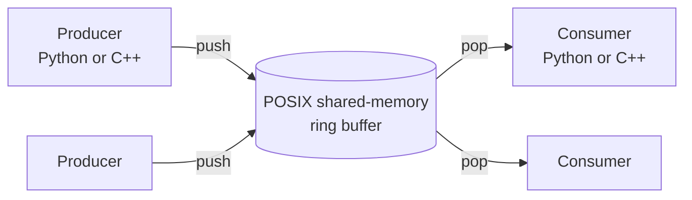

# ipc0cp

**Zero-copy (0CP) inter-process communication between Python and C++ — backed by POSIX shared memory.**

`ipc0cp` lets a Python process and a C++ process (or any mix of them) exchange data — NumPy arrays, images, JSON, raw bytes — through a shared-memory ring buffer instead of piping bytes through stdin/stdout. In our benchmarks that makes the C++ shared-memory path **~3.4× faster** than STDIO framing, and the Python path **~1.5× faster**.

If you're shuttling large payloads (images, tensors, frames) between a Python frontend and a C++ backend on the same host, this library is built for you.

---

## Why ipc0cp?

- **Fast where it matters.** Large payloads go through POSIX shared memory — no pipe-buffer copies. See [Benchmarks](#benchmarks) for measured numbers.
- **Real multi-process MPMC.** Multiple producers and multiple consumers, across separate processes, on the same buffer.
- **Python and C++, same wire format.** Both sides speak JSON metadata + binary payload framing, so a Python producer can feed a C++ consumer and vice versa.
- **Works with the objects you already have.** Built-in support for `bytes`, UTF-8 text, JSON, NumPy arrays, PIL images, and heterogeneous lists. Register your own types when you need to.
- **Honest about trade-offs.** Ships two transports: shared memory (the fast "0CP" path) and a plain STDIO framed transport (a portable baseline — *not* zero-copy).
- **Defensive by default.** Sentinel bytes around payloads catch corruption and overruns; blocking and non-blocking modes with optional timeouts on push/pop.

### When it's a good fit

- High-throughput Python ⇄ C++ pipelines (ML inference, image/video processing, data loaders).
- You control both ends and they run on the same host (shared memory is local-only).

### When it's not

- Cross-host communication — shared memory doesn't cross machine boundaries.
- Tiny, infrequent messages where setup overhead dominates and a plain pipe is simpler.

### vs `multiprocessing.Queue`

Python's stdlib `multiprocessing.Queue` is **not** zero-copy. A single `put`/`get` round-trip
does roughly four copies plus serialization:

1. **pickle** the object into a `bytes` buffer (CPU + GIL time, copy #1),
2. a feeder thread **writes** those bytes into an OS pipe (copy into the kernel buffer, #2),
3. the consumer **reads** them back out (copy out of the kernel buffer, #3),
4. **unpickle** to rebuild the object (copy #4 + allocation).

For large payloads (images, tensors, frames) the pickle step alone dominates. `ipc0cp` skips
pickling and the double pipe copy by exchanging payloads directly through POSIX shared memory —
that's where the measured ~1.5× Python speedup below comes from.

|  | `multiprocessing.Queue` | `multiprocessing.shared_memory` | **ipc0cp** |
|---|---|---|---|
| Zero-copy for large payloads | ✗ (pickle + pipe) | ✓ (raw buffer) | ✓ |
| Queue / MPMC semantics | ✓ | ✗ (manual) | ✓ |
| Framing + variable-size slots | ✓ | ✗ (manual) | ✓ |
| End-of-stream signaling | partial | ✗ (manual) | ✓ |
| C++ interop | ✗ | ✗ | ✓ |

In short: `ipc0cp` is roughly "`multiprocessing.shared_memory` + the queue, framing, synchronization,
and serialization machinery you'd otherwise hand-roll" — plus a matching C++ side. For *small*,
infrequent messages, `multiprocessing.Queue` is simpler and its overhead is negligible; ipc0cp's
win is specifically on **large payloads**.

---

## How it works



Each message is a variable-size slot: JSON **metadata** describing the payload, plus the **binary payload** itself. Synchronization uses POSIX named semaphores with a lightweight condition-like wakeup. Consumers return `None` when the buffer is empty and `active_producers == 0`, giving you a clean end-of-stream signal.

For the full memory layout, see [ARCHITECTURE.md](ARCHITECTURE.md).

---

## Installation

### Python

```bash
pip install -e .          # runtime
pip install -e ".[dev]"   # + pytest and friends
```

### C++ (library + tests)

```bash
cmake -S . -B build -DCMAKE_BUILD_TYPE=Release -DIPC0CP_TESTS=ON
cmake --build build -j
ctest --test-dir build
```

Or use the `Makefile` for the common chores:

```bash
make build        # configure + build C++
make test-cpp     # build + run ctest
make test-py      # install dev deps + run pytest
make test         # both suites
make help         # list all targets
```

---

## Quickstart

### Python — shared memory

Producer (process 1):

```python
import numpy as np
from ipc0cp import SharedRingBufferProducer

producer = SharedRingBufferProducer(
    shm_name="my_buffer",
    total_data_bytes=256 * 1024 * 1024,
    blocking=True,
)

producer.push(np.random.randint(0, 255, (480, 640, 3), dtype=np.uint8))
producer.push({"msg": "hello", "id": 123})
producer.push(b"raw bytes")

producer.close()   # decrements active_producers
```

Consumer (process 2):

```python
from ipc0cp import SharedRingBufferConsumer

consumer = SharedRingBufferConsumer(
    shm_name="my_buffer",
    total_data_bytes=256 * 1024 * 1024,
    blocking=True,
    auto_attach=True,
    auto_unlink=True,  # last consumer cleans shared memory + semaphores
)

while True:
    obj = consumer.pop(timeout=5.0)
    if obj is None:    # end of stream
        break
    print(type(obj))

consumer.close()       # if last consumer and auto_unlink=True, this cleans up
```

> **Lifecycle notes**
> - Producers wait (up to 60s) for at least one consumer to attach before pushing.
> - Producers never unlink shared memory; cleanup is owned by the last consumer.

### Python — STDIO (portable baseline)

```bash
python -c 'from ipc0cp import StdioProducer; p=StdioProducer(); p.push({"k": "v"}); p.close()' \
  | python -c 'from ipc0cp import StdioConsumer; c=StdioConsumer(); print(c.pop())'
```

### C++ — shared memory consumer

```cpp
#include "ipc0cp/ring_buffer.hpp"
#include <chrono>

int main() {
  ipc0cp::SharedRingBufferConsumer consumer("my_buffer", 256ULL * 1024 * 1024);

  while (true) {
    auto obj = consumer.pop(std::chrono::milliseconds(5000));
    if (!obj) break; // end of stream
    // obj->data is a polymorphic ipc0cp::SerializableObject
  }
}
```

The Python public API is split by role: `SharedRingBufferProducer` / `SharedRingBufferConsumer` for SHM, and `StdioProducer` / `StdioConsumer` for STDIO. The C++ library mirrors the same concepts and object model.

---

## Supported payloads

Out of the box you can push and pop:

| Type | Python | Notes |
|---|---|---|
| Bytes | `bytes` | raw binary |
| Text | `str` | UTF-8 |
| JSON | `dict` / JSON-compatible values | |
| NumPy array | `np.ndarray` | dtype + shape preserved |
| Image | `PIL.Image` | |
| List | `list` | heterogeneous, see below |

### List payloads

Pushing a Python `list` (or building a C++ `ListData`) produces a `metadata` entry like
`{"type": "list", "version": "1.0", "count": 3, "items": [ ... ]}`. Each child record keeps its
nested metadata plus a `payload_size`, and the slot payload is the concatenation of the serialized
items. Lists may mix payloads (bytes, text, JSON, NumPy, nested lists) but are capped at **10 items**
and **10 levels deep** to keep buffer traversal predictable. Deserialization unpacks them back into
native objects automatically.

### Custom serializers

Once registered, the `TypeRegistry` dispatches both directions:

- **Python:** `from ipc0cp.type_registry import register_type` and supply a callable
  `(metadata: Dict[str, str], payload: bytes) -> SerializableObject`. It's used whenever metadata
  carries the matching `type` (and optional `version`).
- **C++:** `ipc0cp::TypeRegistry::instance().register_type("MyType", my_deserializer, "1.0")`, where
  `my_deserializer` accepts the metadata map and payload bytes.

The registry is seeded with built-in handlers for `bytes`, `text`, `json`, `image`, `ndarray`, and
`list`, so you can extend or override without breaking the wire format. Unknown types log a warning
and fall back to raw `BytesData` — the consumer never blocks, even if a newer producer introduces a
type it doesn't recognize.

---

## Examples and tests

Python example scripts live in `python/tests/`:

```bash
# Terminal 1
python python/tests/consumer_example.py -s example_buffer --buffer-size 100

# Terminal 2
python python/tests/producer_example.py -s example_buffer -n 100 --buffer-size 100
```

---

## Benchmarks

The benchmark harness compares shared memory (SHM, the "0CP" path) against the STDIO baseline.
See [benchmarks/README.md](benchmarks/README.md) for the full methodology and variants.

```bash
python benchmarks/run_benchmark.py --duration 10
```

Results below are from 3 runs × 10s, payloads 512KB–5MB, payload-throughput only
([benchmarks/benchmark_results_251226-235421.json](benchmarks/benchmark_results_251226-235421.json)):

| Variant | Producer mean (MB/s) | Consumer mean (MB/s) | Speedup |
|---|---:|---:|---:|
| Python STDIO (raw framing) | 342.45 | 342.38 | — |
| Python STDIO (API framing) | 339.90 | 339.86 | — |
| Python Shared Memory (SHM) | 497.20 | 502.49 | 1.48× |
| C++ STDIO (API framing) | 677.26 | 677.26 | — |
| C++ Shared Memory (SHM) | 2312.92 | 2299.72 | 3.40× |
| Python → C++ STDIO (API) | 329.39 | 311.55 | — |
| Python → C++ Shared Memory (SHM) | 351.53 | 464.10 | 1.49× |

Global speedups (consumer throughput): SHM vs STDIO (raw) **1.47×**, SHM vs STDIO (API) **1.48×**.

> Numbers are from one machine and one payload profile — treat them as directional, and run the
> harness on your own hardware and payloads before drawing conclusions.

---

## Logging

```python
import ipc0cp
ipc0cp.enable_logging()
ipc0cp.set_log_level("INFO")
```

---

## Roadmap

- Evaluate integrating [FlatBuffers](https://github.com/google/flatbuffers/) for schema-driven,
  zero-copy serialization alongside the existing metadata-driven payloads.

## Contributing

Contributions are welcome — please open an issue or submit a pull request.

## License

Apache License 2.0 — see [LICENSE](LICENSE).

## Authors

- Thamme Gowda
